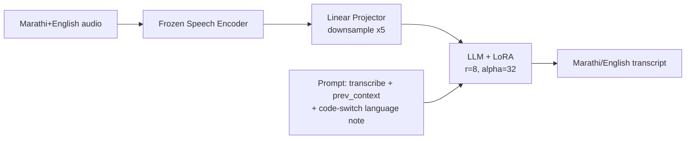

# 🎙️ Marathi ASR — Encoder & LLM Comparison

### SLAM-ASR for Marathi + English code-switched speech recognition

A controlled comparison of **6 speech-encoder / LLM combinations** for Marathi+English
code-switched ASR, fine-tuned with LoRA on top of frozen encoders and frozen LLMs, evaluated on
**7 benchmark test sets**.

---

## 📋 Table of contents

- [Overview](#-overview)
- [Architecture](#-architecture)
- [Models compared](#-models-compared)
- [Results](#-results)
- [Repository layout](#-repository-layout)
- [Quickstart](#-quickstart)
- [Documentation](#-documentation)
- [License & acknowledgements](#-license--acknowledgements)

## 🔭 Overview

Every model here follows the same **SLAM-ASR** recipe (frozen encoder → linear projector → frozen
LLM + LoRA), trained on the same 526k-utterance Marathi+English bilingual dataset, with the same
optimizer, batch size, and LoRA config. Only the **speech encoder** — and, for one run, the
**LLM** — changes between runs, so any WER difference is attributable to that swap alone.

| | |
|---|---|
| 🗣️ Languages | Marathi, English (code-switched) |
| 🧩 Encoders compared | data2vec-AQC (FT & SSL), ccc-wav2vec2.0 (FT), Whisper large-v3, XEUS |
| 🤖 LLMs compared | Gemma-3-4B-IT, Sarvam-1 |
| 📊 Test sets | CommonVoice, FLEURS, IndicTTS, Kathbath (+noisy), MUCS, R12 |
| 🏋️ Training data | 526,134 utterances, ~1,180 hours |

## 🏗️ Architecture

Details: [`docs/ARCHITECTURE.md`](docs/ARCHITECTURE.md)

## 🧩 Models compared