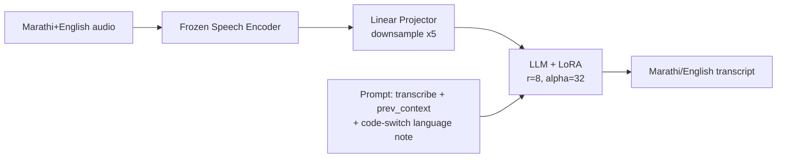

<div align="center">

# 🎙️ Marathi ASR — Encoder & LLM Comparison

### SLAM-ASR for Marathi + English code-switched speech recognition

[](LICENSE)
[](docs/DATASET.md)
[](docs/ENCODERS.md)
[](docs/DATASET.md)
[](https://github.com/ddlBoJack/SLAM-LLM)

A controlled comparison of **6 speech-encoder / LLM combinations** for Marathi+English
code-switched ASR, fine-tuned with LoRA on top of frozen encoders and frozen LLMs, evaluated on
**7 benchmark test sets**.

</div>

---

## 📋 Table of contents

- [Overview](#-overview)
- [Architecture](#-architecture)
- [Models compared](#-models-compared)
- [Results](#-results)
- [Repository layout](#-repository-layout)
- [Quickstart](#-quickstart)
- [Documentation](#-documentation)
- [License & acknowledgements](#-license--acknowledgements)

## 🔭 Overview

Every model here follows the same **SLAM-ASR** recipe (frozen encoder → linear projector → frozen
LLM + LoRA), trained on the same 526k-utterance Marathi+English bilingual dataset, with the same
optimizer, batch size, and LoRA config. Only the **speech encoder** — and, for one run, the
**LLM** — changes between runs, so any WER difference is attributable to that swap alone.

| | |
|---|---|
| 🗣️ Languages | Marathi, English (code-switched) |
| 🧩 Encoders compared | data2vec-AQC (FT & SSL), ccc-wav2vec2.0 (FT), Whisper large-v3, XEUS |
| 🤖 LLMs compared | Gemma-3-4B-IT, Sarvam-1 |
| 📊 Test sets | CommonVoice, FLEURS, IndicTTS, Kathbath (+noisy), MUCS, R12 |
| 🏋️ Training data | 526,134 utterances, ~1,180 hours |

## 🏗️ Architecture



Details: [`docs/ARCHITECTURE.md`](docs/ARCHITECTURE.md)

## 🧩 Models compared

| # | Encoder | LLM | Marathi fine-tuned encoder? | Card |
|---|---|---|:---:|---|
| 1 | data2vec-AQC | Gemma-3-4B-IT | ✅ | [`results/data2vec-FT_Gemma3`](results/data2vec-FT_Gemma3/README.md) |
| 2 | ccc-wav2vec2.0 | Gemma-3-4B-IT | ✅ | [`results/ccc-wav2vec2-FT_Gemma3`](results/ccc-wav2vec2-FT_Gemma3/README.md) |
| 3 | data2vec-AQC | Sarvam-1 | ✅ | [`results/data2vec-FT_Sarvam1`](results/data2vec-FT_Sarvam1/README.md) |
| 4 | data2vec-AQC (SSL) | Gemma-3-4B-IT | ❌ | [`results/data2vec-SSL_Gemma3`](results/data2vec-SSL_Gemma3/README.md) |
| 5 | Whisper large-v3 | Gemma-3-4B-IT | ❌ | [`results/Whisper_Gemma3`](results/Whisper_Gemma3/README.md) |
| 6 | XEUS | Gemma-3-4B-IT | ❌ | [`results/XEUS_Gemma3`](results/XEUS_Gemma3/README.md) |

Full encoder specs: [`docs/ENCODERS.md`](docs/ENCODERS.md)

## 📊 Results

**WER% on 6 complete test sets** (checkpoint: epoch 1 / step 32,000 for every model — controlled comparison):

| Test set | data2vec-FT+Gemma3 | ccc-wav2vec2+Gemma3 | Sarvam-1+FT | data2vec-SSL+Gemma3 | Whisper+Gemma3 | XEUS+Gemma3 |
|---|---|---|---|---|---|---|
| commonvoice | **22.49** | 24.16 | 23.53 | 25.23 | 29.27 | 35.80 |
| fleurs | **23.88** | 26.57 | 26.77 | 26.57 | 29.57 | 30.43 |
| indictts | **16.15** | 18.26 | 17.26 | 19.27 | 18.97 | 21.90 |
| kathbath | **21.29** | 23.74 | 22.73 | 25.04 | 26.99 | 31.96 |
| kathbath_noisy | **22.14** | 23.97 | 23.22 | 27.25 | 28.94 | 33.38 |
| mucs | 29.24 | 27.96 | 43.62 | 34.82 | **26.99** | 35.28 |

**Bold = best (lowest WER)**. A 7th, larger test set (R12, 6,282 utterances) is still decoding —
see [`results/SUMMARY.md`](results/SUMMARY.md) for its preliminary numbers and full takeaways.

## 📁 Repository layout

```
├── scripts/
│   ├── training/     6 training scripts (one per encoder/LLM combo)
│   └── decoding/     6 decode scripts + WER scorer + path-rewrite helper
├── src_patches/      2 small patches on top of the SLAM-LLM framework
├── results/          per-model WER files, config snapshot, and README card
├── docs/             architecture, encoders, dataset, training, decoding, resume-fix write-ups
└── CHANGELOG.md
```