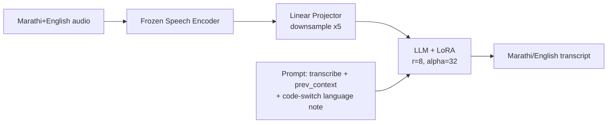

# Architecture

Every model here follows the same **SLAM-ASR** recipe: a frozen speech encoder feeds a trainable
linear projector, which feeds a frozen LLM fine-tuned only through LoRA adapters.

**What changes between the 6 runs in this repo:** only the encoder box (data2vec-AQC variants,
ccc-wav2vec2, Whisper, XEUS) and, for one run, the LLM box (Gemma-3-4B-IT vs Sarvam-1). Everything
else -- projector, LoRA config, prompt template, data, optimizer, schedule -- is held fixed, so
that WER differences are attributable to the encoder/LLM swap alone.

## Encoder frame rate

All encoders downsample audio to ~50 frames/sec except Whisper (mel input, ~100 frames/sec pre-
projector). The projector's `encoder_projector_ds_rate=5` then reduces this to ~10-20 tokens/sec
of audio fed into the LLM, keeping the LLM context length manageable for a 20-30s utterance.
