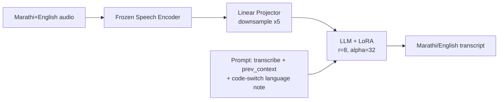

# Architecture

Every model here follows the same **SLAM-ASR** recipe: a frozen speech encoder feeds a trainable
linear projector, which feeds a frozen LLM fine-tuned only through LoRA adapters.

```mermaid
flowchart LR
    A[Marathi+English audio] --> B[Frozen Speech Encoder]
    B --> C[Linear Projector<br/>downsample x5]
    C --> D[LLM + LoRA<br/>r=8, alpha=32]
    P["Prompt: transcribe + prev_context<br/>+ code-switch language note"] --> D
    D --> E[Marathi/English transcript]
```